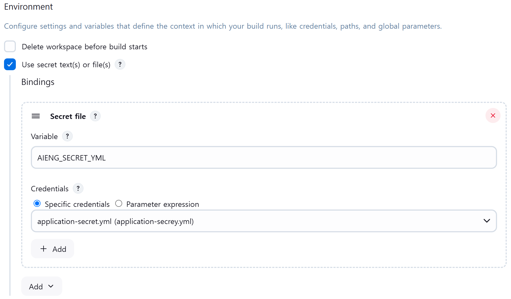

# 아이잉 포팅 매매뉴얼

# 1. 시스템 구성

| 항목 | EC2 서버 | GPU 서버 |
| --- | --- | --- |
| 주요 역할 | 앱 API 개발 및 테스트 | AI 모델 추론, 이미지/음성 생성 |
| OS | Ubuntu 22.04.4 LTS | Ubuntu 20.04.6 LTS |
| CPU | Intel(R) Xeon(R) CPU E5-2686 v4 @ 2.30GHz | Intel(R) Xeon(R) CPU E5-2680 v4 @ 2.40GHz |
| GPU | - | 1x RTX 4090  |
| RAM | 15G | 62G |
| 디스크 용량 | 310GB | 150GB(100GB 이상 필수) |
| Python | 3.10.12 | - ComfyUI: 3.12.8
- FastAPI: 3.11.11 |
| 기타 | - | CUDA 12.6 |

---

# 2. 주요 사용 경로 및 포트

- EC2
    
    
    | 서비스 | 포트 | 설명 |
    | --- | --- | --- |
    | Java Spring Boot | 8001 | 백엔드 API |
    | Nginx | 80, 443 | 프록시 및 HTTPS 처리 |
    | Jenkins | 8081 | CI/CD |
    | Maria DB | 3306 | DB |
    | Redis | 6379 | Redis DB |
- GPU
    
    
    | 서비스 | 포트 | 설명 |
    | --- | --- | --- |
    | FastAPI | 8000 | AI 관련 API 제공 |
    | ComfyUI | 8188 | 이미지 생성 |

> ⚠️ 포트 개방 필요 (예: `sudo ufw allow 8000/tcp`, `sudo ufw allow 8188/tcp` 등)
> 

---

# 3. 환경 세팅

## 3.1 EC2

- 도커 설치
    
    ```python
    # 방화벽 허용
    sudo ufw allow 8080/tcp
    
    # docker 설치
    sudo apt-get update
    sudo apt-get install ca-certificates curl
    sudo install -m 0755 -d /etc/apt/keyrings
    sudo curl -fsSL https://download.docker.com/linux/ubuntu/gpg -o /etc/apt/keyrings/docker.asc
    sudo chmod a+r /etc/apt/keyrings/docker.asc
    
     Add the repository to Apt sources:
    echo \
      "deb [arch=$(dpkg --print-architecture) signed-by=/etc/apt/keyrings/docker.asc] https://download.docker.com/linux/ubuntu \
      $(. /etc/os-release && echo "${UBUNTU_CODENAME:-$VERSION_CODENAME}") stable" | \
      sudo tee /etc/apt/sources.list.d/docker.list > /dev/null
    sudo apt-get update
    sudo apt-get install docker-ce docker-ce-cli containerd.io docker-buildx-plugin docker-compose-plugin
    
    # test
    sudo docker run hello-world
    
    # docker 권한 설정
    getent group docker
    sudo usermod -aG docker root
    
    # docker compose 설치
    sudo apt install docker-compose-plugin
    docker compose version
    ```
    
- nginx conf 설정
    
    ```python
    #/home/ubuntu/nginx.conf
    # certbot으로 키 발급하고 사용
    
    events {}
    
    http {
        server {
            listen 80 default_server;
            listen [::]:80 default_server;
            server_name _;
            return 444;
        }
    
        server {
            listen 443 ssl default_server;
            listen [::]:443 ssl default_server;
            server_name _;
            ssl_certificate /etc/letsencrypt/live/www.aieng.co.kr/fullchain.pem;
            ssl_certificate_key /etc/letsencrypt/live/www.aieng.co.kr/privkey.pem;
            return 444;
        }
    
        server {
            listen 80;
            server_name www.aieng.co.kr;
    
            location /.well-known/acme-challenge/ {
                root /var/www/certbot;
            }
    
            location / {
                return 301 https://$host$request_uri;
            }
        }
    
        server {
            listen 443 ssl;
            server_name www.aieng.co.kr;
    
            ssl_certificate /etc/letsencrypt/live/www.aieng.co.kr/fullchain.pem;
            ssl_certificate_key /etc/letsencrypt/live/www.aieng.co.kr/privkey.pem;
    
            location = /app-download {
                root /var/www/aieng;
                try_files /aieng.apk =404;
                add_header Content-Disposition "attachment; filename=aieng.apk";
                default_type application/vnd.android.package-archive;
            }
            
            location /jenkins/ {
                proxy_pass http://jenkins:8080/jenkins/;
                proxy_set_header Host $host;
                proxy_set_header X-Real-IP $remote_addr;
            }
    
            location /api/ {
                proxy_pass http://43.201.251.148:8081/api/;
                proxy_set_header Host $host;
                proxy_set_header X-Real-IP $remote_addr;
            }
            location /fastapi/ {
                proxy_pass http://43.201.251.148:8000/;
                proxy_set_header Host $host;
                proxy_set_header X-Real-IP $remote_addr;
            }
        }
    }
    ```
    
- docker compose
    
    ```bash
    # /home/ubuntu/compose.yml
    # 젠킨스, nginx, certbot 컨테이너 실행 compose
    
    services:
      nginx:
        image: nginx:latest
        container_name: nginx-https
        ports:
          - "80:80"
          - "443:443"
        volumes:
          - ./nginx/nginx.conf:/etc/nginx/nginx.conf
          - /var/www/certbot:/var/www/certbot
          - /etc/letsencrypt:/etc/letsencrypt
          - /home/ubuntu/aieng.apk:/var/www/aieng/aieng.apk
        restart: unless-stopped
    
      certbot:
        image: certbot/certbot
        container_name: certbot
        volumes:
          - ./certbot/www:/var/www/certbot
          - ./certbot/conf:/etc/letsencrypt
        entrypoint: "/bin/sh -c 'trap exit TERM; while :; do sleep 1; done;'"
        depends_on:
          - nginx
    
      jenkins:
        image: jenkins/jenkins:lts
        container_name: jenkins
        volumes:
          - /home/ubuntu/jenkins-data:/var/jenkins_home
          - /var/run/docker.sock:/var/run/docker.sock
          - /usr/bin/docker:/usr/bin/docker
          - /usr/libexec/docker/cli-plugins:/usr/libexec/docker/cli-plugins
        environment:
          - JENKINS_OPTS=--prefix=/jenkins
        group_add:
          - ${DOCKER_GID}
        restart: unless-stopped
        
    ```
    

## 3.2 BE

- Dockerfile
    
    ```bash
    # Spring Boot Dockerfile
    # S12P31B104/backend/Dockerfile
    
    # Build stage
    FROM gradle:7.6.1-jdk17 AS Build 
    WORKDIR /app
    COPY aieng .
    RUN chmod +x ./gradlew
    RUN ./gradlew clean build -x test
    
    # Run stage
    FROM openjdk:17-slim
    WORKDIR /app
    COPY --from=build /app/build/libs/*.jar app.jar
    
    EXPOSE 80
    ENTRYPOINT ["java", "-jar", "app.jar"]
    ```
    
    ```bash
    # mariadb Dockerfile
    # Jenkins 컨테이너의 /var/jenkins_home/secrets/Dockerfile
    
    FROM mariadb:latest
    
    RUN apt-get update && \
        apt-get install -y mysql-client && \
        rm -rf /var/lib/apt/lists/*
    ```
    
- Docker compose
    
    ```bash
    # Jenkins 컨테이너의 /var/jenkins_home/secrets/compose.yml
    services:
      backend:
        build: /var/jenkins_home/workspace/deploy-develop/backend
        container_name: backend-server
        environment:
          - SPRING_PROFILES_ACTIVE=prod
        ports:
          - 8081:80
        depends_on:
          mariadb:
            condition: service_healthy
          redis:
            condition: service_healthy
        restart: unless-stopped
      
      # fastapi:
      #   build: /var/jenkins_home/workspace/deploy-develop/ai/fastapi
      #   container_name: fastapi-server
      #   ports:
      #     - "8000:8000"
      #   depends_on:
      #     - mariadb
      #     - redis
      #   restart: always
      #   env_file:
      #     - ./.env
      #   environment:
      #     - GOOGLE_APPLICATION_CREDENTIALS=./tts_key.json
      
      redis:
        image: redis:latest
        container_name: redis-server
        ports:
          - 6379:6379
        volumes:
          - redis-data:/data
        environment:
          - REDIS_PASSWORD=${REDIS_PASSWORD}
        restart: unless-stopped
        healthcheck:
          test: ["CMD", "redis-cli", "ping"]
          interval: 5s
          timeout: 3s
          retries: 54
    
      mariadb:
        image: mariadb:latest
        container_name: mariadb-server
        ports:
          - 3306:3306
        restart: unless-stopped
        environment:
          MARIADB_DATABASE: ${MARIADB_DATABASE}
          MARIADB_USER: ${MARIADB_USER}
          MARIADB_PASSWORD: ${MARIADB_PASSWORD}
          MARIADB_ROOT_PASSWORD: ${MARIADB_ROOT_PASSWORD}
        volumes:
          - mariadb-data:/var/lib/mysql
        healthcheck:
          test: ["CMD", "bash", "-c", "echo > /dev/tcp/127.0.0.1/3306"]
          interval: 5s
          timeout: 3s
          retries: 5
            
    volumes:
      redis-data:
      mariadb-data:
    ```
    

### 3.3 Jenkins

- 서버 접속 및 기본 설정 세팅
    - Gitlab 연결, 계정 생성 등..
- 설정
    - application-secret.yml 파일 가져오기(Dashboard>Jenkins관리>Credentials에서 파일 등록)
        
        
        
    - **Execute shell**
        
        ```bash
        ################################ Discord ###################################
        send_discord_build_result() {
          if [ $? -eq 0 ]; then
            BUILD_STATUS="SUCCESS"
            COLOR=65280
            TITLE="✅ 빌드 성공"
          else
            BUILD_STATUS="FAILURE"
            COLOR=16711680
            TITLE="❌ 빌드 실패"
          fi
        
          if [ "$GITLAB_ACTION" = "PUSH" ]; then
            ACTION_DESC="푸시한 사람"
          elif [ "$GITLAB_ACTION" = "MERGE" ]; then
            ACTION_DESC="머지한 사람"
          else
            ACTION_DESC="작업자"
          fi
        
          DESCRIPTION="**$JOB_NAME** (#$BUILD_NUMBER) 빌드 결과: $BUILD_STATUS\n👤 GitLab $ACTION_DESC: **$GITLAB_USER**"
        
          curl -H "Content-Type: application/json" \
            -X POST \
            -d "{
            \"embeds\": [
              {
                \"title\": \"$TITLE\",
                \"description\": \"$DESCRIPTION\n\n🔍 [로그 보기]($BUILD_URL)\",
                \"color\": $COLOR
              }
            ]
          }" "$WEBHOOK_URL"
        }
        
        trap send_discord_build_result EXIT
        
        # 👉 빌드 시작 메시지 전송
        WEBHOOK_URL="https://discord.com/api/webhooks/1370222245695324181/5www5PgOfIsfnsfYlNeFgqsVcfF3CD-waZZJ58tk8qUPzONvBI9Ld93PpZzmUwChVXNF"
        BUILD_START_TITLE="🚧 빌드 시작 및 서버 중단"
        # Jenkins 변수
        JOB_NAME=${JOB_NAME:-"Unknown Job"}
        BUILD_NUMBER=${BUILD_NUMBER:-0}
        BUILD_STATUS=${BUILD_STATUS:-"SUCCESS"}
        BUILD_URL=${BUILD_URL:-"$JENKINS_BASE_URL/job/$JOB_NAME/$BUILD_NUMBER/"}
        
        # GitLab 정보
        GITLAB_USER=${gitlabUserName:-"알 수 없음"}
        GITLAB_ACTION=${gitlabActionType:-"UNKNOWN"}
        
        BUILD_START_DESC="**$JOB_NAME** (#$BUILD_NUMBER) 빌드를 시작합니다.\n🔌 현재 서버는 재시작 중입니다.\n👤 GitLab $ACTION_DESC: **$GITLAB_USER**"
        
        curl -H "Content-Type: application/json" \
          -X POST \
          -d "{
          \"embeds\": [
            {
              \"title\": \"$BUILD_START_TITLE\",
              \"description\": \"$BUILD_START_DESC\",
              \"color\": 16753920
            }
          ]
        }" "$WEBHOOK_URL"
        
        ##############################BE Start########################################
        # 1. 프로젝트 디렉토리 이동
        cd /var/jenkins_home/workspace/deploy-develop/backend/aieng/src/main/resources
        
        # 2. 기존 파일 있으면 삭제 (권한 제한 방지)
        [ -f application-secret.yml ] && rm -f application-secret.yml
        
        # 3. secret 파일 복사
        cp "$AIENG_SECRET_YML" ./application-secret.yml
        
        # 4. Docker Compose 재시작
        cd /var/jenkins_home/secrets
        docker compose down --remove-orphans
        docker compose up -d --build
        
        # fastapi 사용시
        #docker cp ./tts_key.json fastapi-server:/app/tts_key.json
        ```
        

## 3.4 GPU

```bash
# 사용하는 디렉토리로 이동
cd /workspace
# 없으면 생성
mkdir /workspace && cd /workspace

# git 설치
sudo apt update && sudo apt install -y git wget curl unzip

########################## ComfyUI #######################
# ComfyUI 다운
git clone https://github.com/comfyanonymous/ComfyUI.git

# Python 설치 3.12.8
sudo apt update
sudo apt install -y software-properties-common build-essential libssl-dev zlib1g-dev \
libbz2-dev libreadline-dev libsqlite3-dev curl llvm libncursesw5-dev xz-utils tk-dev \
libxml2-dev libxmlsec1-dev libffi-dev liblzma-dev git

cd /usr/src
sudo curl -O https://www.python.org/ftp/python/3.12.8/Python-3.12.8.tgz
sudo tar xzf Python-3.12.8.tgz
cd Python-3.12.8

sudo ./configure --enable-optimizations
sudo make -j$(nproc)  # 병렬 컴파일
sudo make altinstall   # `python3.12` 이름으로 설치됨'

python3.12 --version
# 출력: Python 3.12.8

# 가상환경 생성 및 라이브러리 설치
cd /workspace/ComfyUI
python3.12 -m venv venv
source venv/bin/activate
pip install -r requirements.txt

##################### Fast API #####################
# FastAPI 다운
git clone https://lab.ssafy.com/s12-final/S12P31B104.git

# Zonos 사용 Python version 설치
# python 3.11.11 소스 다운
cd /usr/src
sudo wget https://www.python.org/ftp/python/3.11.11/Python-3.11.11.tgz
#압축해제
sudo tar xzf Python-3.11.11.tgz
cd Python-3.11.11
# 설치
sudo ./configure --enable-optimizations
sudo make -j$(nproc)
sudo make altinstall

# 설치확인
python3.11 --version
# → Python 3.11.11

# Zonos 가상환경 생성
cd /workspace
python3.11 -m venv venv_zunos
source venv_zunos/bin/activate

# 필요 라이브러리 설치
cd /workspace/S12P31B104/ai/fastapi/
git switch feat/AI_TTS
pip install -r requirements.txt
```

---

## 4. 환경 변수

- Spring Boot 빌드 환경변수
    - application-secret/yml
        
        ```python
        # Jenkins에서 gitlab pull 받고 경로에 저장함
        
        spring:
          datasource:
            url: 
            username: 
            password: 
        
          data:
            redis:
              password: 
        
        oauth:
          kakao:
            client-id: 
            client-secret: 
          google:
            client-id: 
            client-secret: 
          naver:
            client-id: 
            client-secret: 
        
        jwt:
          secret:
          
        aws:
          s3:
            bucket: 
          region: 
          access-key: 
          secret-key: 
        ```
        

- DB 환경변수
    - .env
        
        ```python
        # Jenkins 컨테이너 내부 /var/jenkins_home/secrets/.env
        REDIS_PASSWORD=
        
        MARIADB_DATABASE=
        MARIADB_USER=
        MARIADB_PASSWORD=
        MARIADB_ROOT_PASSWORD=
        ```
        
- FastAPI 환경변수
    - .env
        
        ```python
        # S12P31B104/ai/fastapi/.env
        
        #Database
        DB_USER=
        DB_PASSWORD=
        DB_HOST=
        DB_PORT=
        DB_NAME=
        
        # Redis
        REDIS_HOST=
        REDIS_PORT=
        REDIS_DB=
        
        # AWS S3
        S3_ACCESS_KEY=
        S3_SECRET_KEY=
        S3_BUCKET_NAME=
        S3_REGION=
        
        # External APIs
        OPENAI_API_KEY=
        OPENAI_BASE_URL=
        TTS_API_KEY=
        SONAUTO_API_KEY=
        ```
        
    - tts_key.json
        
        ```python
        # S12P31B104/ai/fastapi/tts_key.json
        
        {
          "type": "",
          "project_id": "",
          "private_key_id": "",
          "private_key": "",
          "client_email": "",
          "client_id": "",
          "auth_uri": "",
          "token_uri": "",
          "auth_provider_x509_cert_url": "",
          "client_x509_cert_url": "",
          "universe_domain": ""
        }
        
        ```
        

---

# 5. 서버 배포

## 5.1 EC2

```bash
cd /home/ubuntu/

# nginx, certbot, jenkins
docker compose up -d

# Spring Boot, Redis, MariaDB는 Jenkins Execute shell에서 자동 실행 중
```

## 5.2 GPU

```bash
# ComfyUI 실행
cd /workspace/ComfyUI
source venv/bin/activate
nohup python main.py --listen 0.0.0.0 &

# Fast API 서버 실행
cd /workspace/S12P31B104/ai/fastapi
source /workspace/venv_zunos/bin/activate
nohup uvicorn app.main:app --host 0.0.0.0 --port 8000 > /workspace/fastapi.log 2>&1 &
```

---

# 6. 외부 서비스

- Sonauto
- Google TTS, STT
- OpenAI
- KAKAO AUTH
- S3
- EC2
- [vast.ai](http://vast.ai)

---

# 7. 참고사항

- FastAPI, ComfyUI Python 버전 불일치로 `venv`로 분리하여 독립 실행
- MariaDB, Redis, S3는 EC2와 GPU 서버에서 공용으로 사용 중
- 포트 충돌, 리소스 부족 시 프로세스 확인 (`ps`, `kill`, `nvidia-smi`, `lsof -i:포트번호` 등)
- 인증서 자동 갱신 여부 확인

---